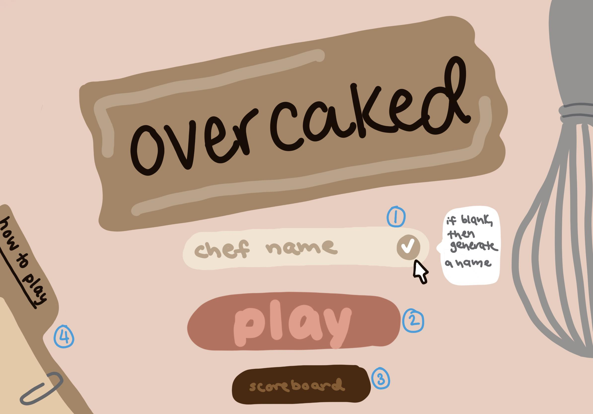
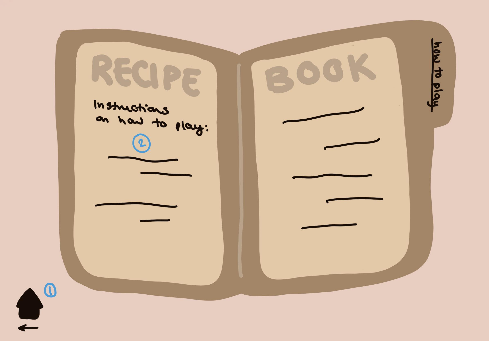
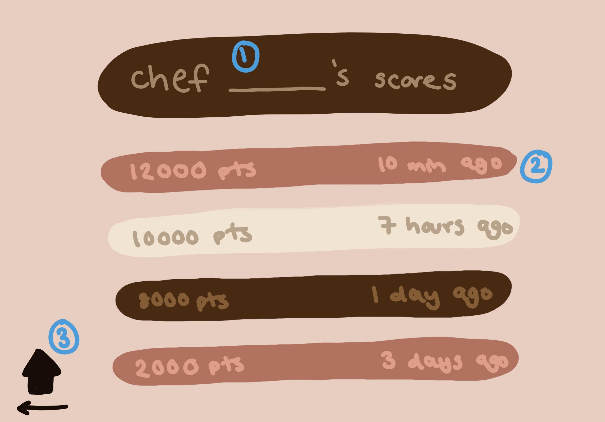
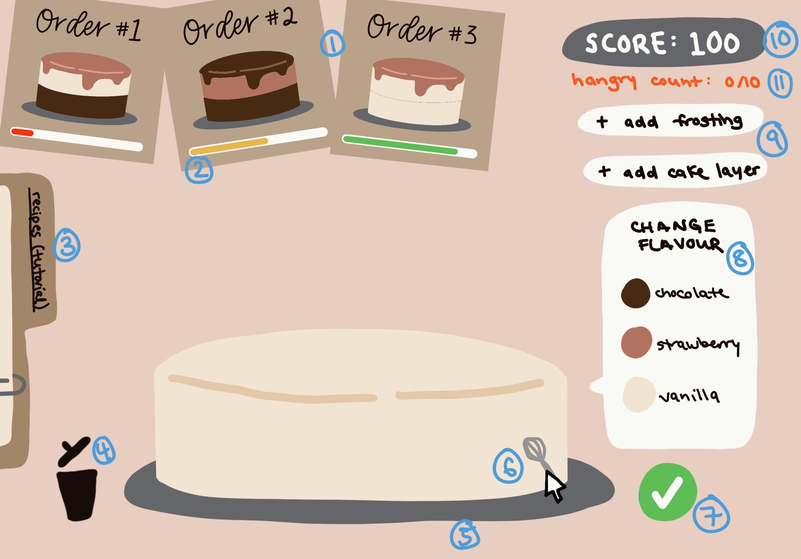

# Overcaked! _(working title)_

## Overview

Welcome to Overcaked! 

<sub>(What do you mean that sounds familiar enough to be a copyright problem?)</sub>

In this game, players will be given cake orders in the form of an image of what the cake should look like when completed and they must assemble a cake according to the order to hand off to customers. Cakes will have varying numbers of layers, layer flavours, and frosting flavours.

Points are earned for successfully submitted orders! Beware the order timers - no hungry customer wants to be left waiting for too long!



### Problem Space

**Short answer**: This project is meant to deliver some good silly fun!

**Longer answer**: Everyone needs a pick-me-up every now and then. This project aims to have a colourful and cheerful design with a main game mechanic that requires just the right amount of concentration that it gives your mind something to do, but is not too frustrating. I hope to bring a smile to someone's face when they play this :)

**Personal answer**: I have been interested in what goes into video game design - especially browser games, which generally need to be designed to be more lightweight - for a long time. The scope of this game is not meant to be super expansive due to the time constraints, but I'd still like to put my newly learned software skills to use on a project that feels exciting to me. Plus I think a site of lil cakes would be super cute!

### User Profile

I forsee players of the game falling into these categories:
1. Anyone who wants to have something fun and quick to do when taking a break from something more serious on their computer

2. Anyone who likes the idea behind a game like Overcooked but gets frustrated with the more complicated mechanics/higher stress level of that game (I'll admit, I've definitely rage-quit before during family game night)

2. Younger kids who might find this game a bit more challenging than adults. Being able to look at an image and identify the constituent parts and colours, counting cake layers, and assessing visual matches must be good for their young brains' development, right? I have two small nieces so I am super excited to show them this game!

### Features

List the functionality that your app will include. These can be written as user stories or descriptions with related details. Do not describe _how_ these features are implemented, only _what_ needs to be implemented.

- Cake card orders will appear on the screen
- Cake orders will have a timer shown through a decreasing bar; once the timer is up, the card will expire and disappear (i.e. player can no longer earn points for completing that specific order)

- Players will be able to add _cake components_ by pressing buttons on screen (layers and a topmost icing layer) as they see fit 
    * A maximum limit will be enforced so that the cake can fit in the screen area
- Players will be able to customize _cake components_ to have different colours/flavours by pressing buttons on screen

- Players will be able to trash a cake when they want to start over by pressing a button on screen
- Players will be able to submit a cake order when they are satisfied with their work by pressing a button on screen

- Orders do not have to be fulfilled in the order of appearance

- Player score will be tracked and displayed on the screen
 
## Implementation

### Tech Stack

List technologies that will be used in your app, including any libraries to save time or provide more functionality. Be sure to research any potential limitations.

#### Front-End
React, axios, SASS, react-router-dom

#### Back-End
Node, Express, CORS, uuid

### APIs

List any external sources of data that will be used in your app.

### Sitemap

List the pages of your app with brief descriptions. You can show this visually, or write it out.

### Mockups

Provide visuals of your app's screens. You can use pictures of hand-drawn sketches, or wireframing tools like Figma.

#### Menu Page


1. Input for user to enter name (if left blank, a placeholder name will be used)

2. Button to begin game

3. Button to see player's score history

4. Button to show game instructions

---

#### Tutorial Page



1. Home button to return to Menu Page

2. Game instructions

---

#### Scoreboard Page



1. Scoreboard title with player's name (player-entered or placeholder)

2. Dynamically timestamped scores displayed in order of highest to lowest

3. Home button to return to Menu Page

---

#### Main Page



1. Order cards
2. Timers on orders
3. Tab to show tutorial modal, which looks like tutorial page but smaller and the Main Page is visible in the background
4. Garbage can icon to scrap cake
5. Plate on which _cake components_ are stacked
6. Clicking on _cake components_ brings up flavour menu

### Data

Describe your data and the relationships between the data points. You can show this visually using diagrams, or write it out. 

Pool of flavours of cakes
Pool of flavours of icing
Randomly generate cake configurations
Get array of cakes
When timeout, write to backend to change that property
When successful submit, write to back
When game over, save score to personal leaderboard (persistent)
Ask for player name (for leaderboard) "Chef ____"
If not want provide then geerator name
list of adj
list of nouns
related to baking
ex. Chef Sweet Buns

(diving deeper: global leaderboard)

### Endpoints

List endpoints that your server will implement, including HTTP methods, parameters, and example responses.
baseurl/generate
baseurl/cakes
baseurl/cake
baseurl/scores

## Roadmap

Scope your project as a sprint. Break down the tasks that will need to be completed and map out timeframes for implementation working back from the capstone due date. 

### Main Chunks

1. Setting up repo
    - Split into `client` and `server` directories
    - Set default branch to `develop`

2. Collect icon assets (garbage can, checkmark, etc.)

3. Create components in front-end
    - Cake layers
    - Icing
    - Plate
    - Order cards
    - Order card timer bar
    - Order card cake images
    - Scoreboard rows
    - Menu page name input
    - Score count
    - Flavour menu

4. Create and route pages in front-end
    - Menu page (`/`)
    - Scoreboard page (`/scoreboard`)
    - Tutorial page (`/howtoplay`)
    - Main page (`/play`)

5. Create data collections in back-end
    - List of cake layer/icing flavours
    - Generate array of cakes
        - Each cake object should have these properties (example properties):
        ```
        {
            id: 1,
            score: 200,
            layerCount: 3,
            layers: ["chocolate", "vanilla", "chocolate"],
            icing: "strawberry",
            expired: false,
            submitted: false
        }
        ```
    - List of player scores so far
        - Sorted to show highest at front of the array
        - Use dynamic timestamp

6. Define HTTP verb + endpoint combinations in back-end
    - See `Endpoints` section

7. Make `axios` calls in appropriate places in front-end to get data from back-end
    - Clicking PLAY button on Menu Page triggers generation of array of cakes (**limit vs infinite play TBD**)
        - Brings player to `/play`/Main Page
    - Clicking SCOREBOARD button on Menu Page fetches scoreboard data to display
         - Brings player to `/score`/Scoreboard Page
    - Clicking CHECKMARK in Menu Page player name input writes name to back-end
        - If field is blank, use placeholder name

8. Create event listeners in front-end to respond to player actions (see #7 for event listeners that have to do with back-end data)
    - On Menu Page
        - Clicking on **Tutorial tab** takes player to `/howtoplay`/Tutorial page
    - On Main Page
        - Clicking **+Add Cake Layer** button adds cake layer
        - Clicking **+Add Icing** button adds icing to top
        - Clicking a **_cake component_** brings up a menu to change its flavour
        - Clicking **garbage can icon** scraps everything on the plate
        - Clicking **checkmark icon** submits the cake to check against the cake orders currently on screen
            - If a match is found, add that's order's cake's `score` property to player's score
            - If not match is found, feedback is given to user so they know the cale submission was wrong
        - Clicking on **Tutorial tab** takes player to `/howtoplay`/Tutorial page
    - On Scoreboard Page
        - Clicking on **home icon** brings user back to `/`/Menu page
    - On Tutorial Page
        - Clicking on **home icon** brings user back to `/`/Menu page

---

## Future Implementations/Nice to Haves
1. Add cheerful music that plays in window
2. Add symbols on flavours (instead of just relying on colours) to increase accessibility
3. Deploy online
    - Save global leaderboard data
4. Expand colours/flavours/number of cake layers (increase cake order complexity)
5. Save data in database instead of JSON
6. Different levels of difficulty (timers shorter/number of concurrent orders increases, etc.)
7. Have back-end store names to randomly generate if player does not give a name
    - Example: Have array of adjectives and array of nouns, randomly pick one of each to give a name, ex. "Frosted Baker"